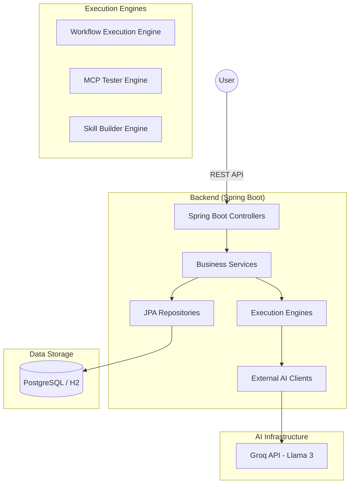
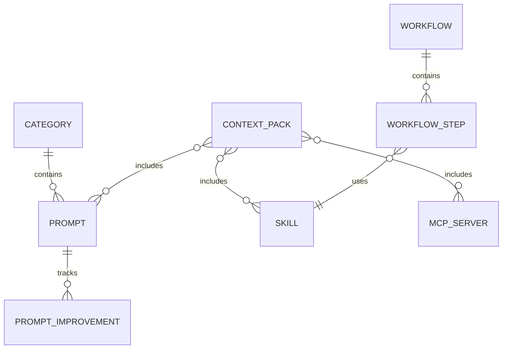

# PromptVault - Technical Architecture

## 🏗️ System Architecture

### Overview

PromptVault is an AI-powered prompt management and automation platform. It follows a clean three-tier architecture:

1.  **Presentation Layer**: React SPA (AI Studio - Available in separate repository)
2.  **Business Logic Layer**: Spring Boot REST API (Java 17)
3.  **Data Layer**: PostgreSQL (Production) / H2 (Development)

### Architecture Diagram



---

## 📂 Project Structure (Backend)

The backend is structured into functional packages following Spring Boot best practices:

- **`com.promptvault.config`**: System configuration (CORS, OpenAPI, Security, Seed Data).
- **`com.promptvault.controller`**: REST controllers for all resources (Prompts, Skills, MCP, Workflows, Context Packs).
- **`com.promptvault.dto`**: Data Transfer Objects for API requests and responses.
- **`com.promptvault.exception`**: Centralized error handling.
- **`com.promptvault.model`**: JPA Entities (Domain Model).
- **`com.promptvault.repository`**: Data access layer using Spring Data JPA.
- **`com.promptvault.service`**: Core business logic and external integrations (GroqClient).

---

## 🚀 Key Modules

### 1. Workflow Engine
The `WorkflowExecutionEngine` allows for sequential execution of prompts with **cumulative context**. Each step in a workflow has access to all previous inputs and outputs, allowing for complex, coherent AI chains.

**Key Features**:
- Accumulative context via `accumulatedContext` List
- Support for SKILL, FREE_PROMPT, and TRANSFORM step types
- Automatic parameter substitution from previous outputs

### 2. MCP System (Model Context Protocol)
Supports management and validation of MCP servers.

**Components**:
- **MCP Validator**: Static JSON structure validation.
- **MCP Connectivity**: Real-time HTTP ping for remote servers.
- **MCP Config Template**: Generate configuration with environment variable placeholders (`GET /api/mcp-servers/{id}/config-template`)

### 3. Skill System
Parameterized prompt templates. The **Skill Builder** uses Groq to automatically generate these templates from natural language descriptions.

**Features**:
- Auto-detection of parameters from prompt templates
- Quality scoring for generated skills
- Support for select, multiselect, and text parameter types

### 4. Context Packs
Bundled resources (Prompts + Skills + MCP Servers) pre-configured for specific domains (Security, DevOps, Writing, etc.).

**Pre-loaded Packs**:
- AI Development Pack
- Security Audit Pack
- Database Development Pack
- Content Writing Pack

### 5. Statistics & Monitoring
Real-time metrics aggregation for platform monitoring.

**Endpoint**: `GET /api/stats/global`

**Metrics**:
- Total Prompts, Skills, MCP Servers, Workflows, Context Packs
- Improvement ratio (prompts improved / total prompts)
- Usage counts for all resources

---

## 🗄️ Database Design

### Entity Relationships



### Core Entities

| Entity | Description | Key Fields |
|--------|-------------|------------|
| **`Prompt`** | Individual AI prompts with metadata | title, content, category, tags, usage_count, quality_score |
| **`Skill`** | Reusable templates with placeholders | name, prompt_template, parameters (JSON), difficulty_level |
| **`MCPServer`** | Configuration for tool-augmented AI | name, command, args, env_vars, config_example, verified |
| **`ContextPack`** | Domain-specific bundles | name, category, emoji, setup_instructions |
| **`Workflow`** | Orchestrated multi-step AI processes | name, description, category, usage_count |
| **`WorkflowStep`** | Individual steps in a workflow | step_type, step_order, skill_id, transform_type |
| **`PromptImprovement`** | Track improvements made by AI | original_content, improved_content, quality, completeness |

### Indexes

Performance indexes on frequently queried fields:
- `mcp_servers`: `verified`, `usage_count`
- `prompts`: `created_at`, `is_favorite`

---

## 🤖 AI Integration (Groq)

PromptVault uses **Groq** as its primary inference engine due to its exceptional speed (LPU™ Technology).

**Configuration**:
- **Default Model**: `llama-3.3-70b-versatile`
- **API Key**: Via environment variable `GROQ_API_KEY`
- **Rate Limits**: 30 req/min, 14,400 req/day (free tier)

**Key Features**:
- High-speed prompt improvement
- Automatic skill generation
- Complex workflow orchestration

---

## 🛡️ Security

- **Environment Isolation**: Separate `application-dev.yml` and `application-prod.yml`.
- **API Protection**: Sensitive keys (like `GROQ_API_KEY`) are managed via environment variables.
- **CORS**: Configured to restrict access to trusted origins.
- **Input Validation**: Jakarta Validation annotations on DTOs.

---

## 📈 Monitoring & Scalability

### Metrics Collection
- Usage counters for all resources (Prompts, Skills, Workflows, MCP Servers)
- Timestamps for creation, updates, and last access
- Quality scores for AI-generated improvements

### Performance Optimizations
- `@Transactional(readOnly = true)` for optimized reads
- Database indexes on frequent search fields
- Lazy loading for entity relationships
- Pagination for list endpoints

### Jackson Configuration
```yaml
spring.jackson:
  default-property-inclusion: always
```

Ensures all DTO fields are serialized in JSON responses, including null values.

---

## 🔧 Recent Enhancements (v1.1.0)

### New Endpoints
- `GET /api/mcp-servers/{id}/config-template` - Generate MCP config with env var placeholders
- `GET /api/stats/global` - Enhanced with `totalWorkflows` and `totalContextPacks`

### DTO Updates
- `GlobalStatsDTO`: Added `totalWorkflows` and `totalContextPacks` fields
- `MCPServerDTO`: Added `configJson` field for dynamic configuration generation

### Service Updates
- `StatsService`: Injected `WorkflowRepository` and `ContextPackRepository` for counting
- `MCPServerService`: Added `generateConfigJson()` and `getConfigTemplate()` methods

### Frontend Integration
- AI Studio React app with full API integration
- Real-time counters in sidebar navigation
- MCP Config modal with environment variable display

---

## 📝 Code Conventions

### Lombok Usage
```java
@Data
@Builder
@NoArgsConstructor
@AllArgsConstructor
public class MyDTO { ... }

@Service
@RequiredArgsConstructor
@Slf4j
public class MyService { ... }
```

### Error Handling
```java
public class ResourceNotFoundException extends RuntimeException {
    public ResourceNotFoundException(String resourceName, String fieldName, Object fieldValue) {
        super(String.format("%s not found with %s = '%s'", resourceName, fieldName, fieldValue));
    }
}
```

### Repository Pattern
```java
@Repository
public interface PromptRepository extends JpaRepository<Prompt, Long> {
    @Query("SELECT COUNT(p) FROM Prompt p WHERE p.improved = true")
    long countImprovedPrompts();
}
```

---

Last updated: 2026-03-15
