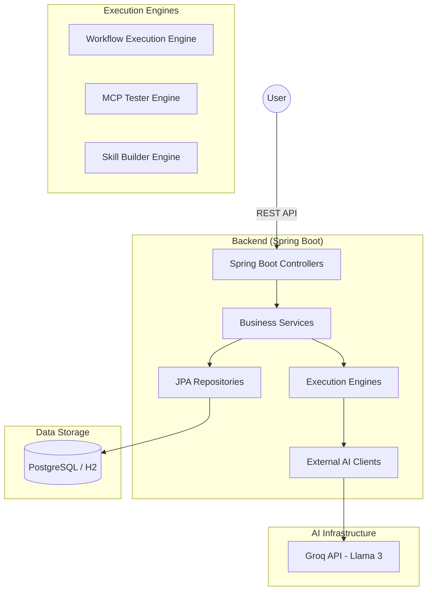
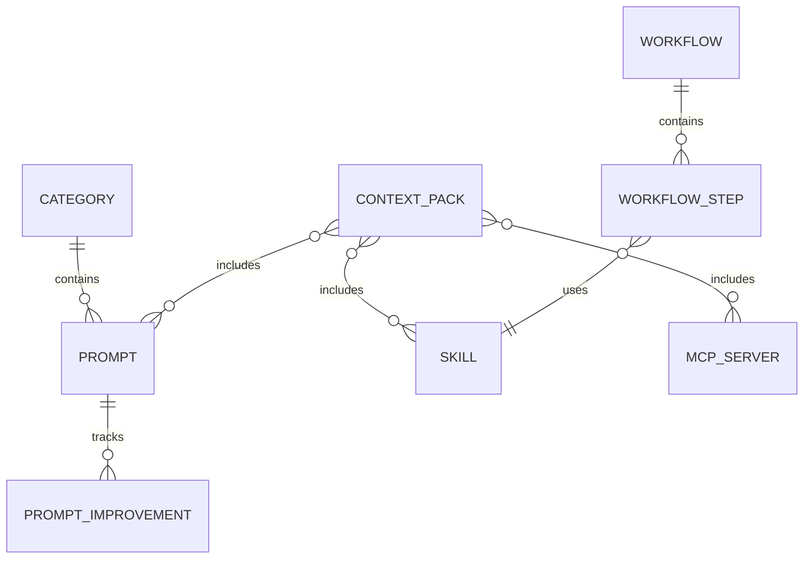

# PromptVault - Technical Architecture

## 🏗️ System Architecture

### Overview

PromptVault is an AI-powered prompt management and automation platform. It follows a clean three-tier architecture:

1.  **Presentation Layer**: React SPA (Planned/Under Development)
2.  **Business Logic Layer**: Spring Boot REST API (Java 17)
3.  **Data Layer**: PostgreSQL (Production) / H2 (Development)

### Architecture Diagram

---

## 📂 Project Structure (Backend)

The backend is structured into functional packages following Spring Boot best practices:

- **`com.promptvault.config`**: System configuration (CORS, OpenAPI, Security, Seed Data).
- **`com.promptvault.controller`**: REST controllers for all resources (Prompts, Skills, MCP, Workflows, Context Packs).
- **`com.promptvault.dto`**: Data Transfer Objects for API requests and responses.
- **`com.promptvault.exception`**: Centralized error handling.
- **`com.promptvault.model`**: JPA Entities (Domain Model).
- **`com.promptvault.repository`**: Data access layer using Spring Data JPA.
- **`com.promptvault.service`**: Core business logic and external integrations (GroqClient).

---

## 🚀 Key Modules

### 1. Workflow Engine
The `WorkflowExecutionEngine` allows for sequential execution of prompts with **cumulative context**. Each step in a workflow has access to all previous inputs and outputs, allowing for complex, coherent AI chains.

### 2. MCP System (Model Context Protocol)
Supports management and validation of MCP servers.
- **MCP Validator**: Static JSON structure validation.
- **MCP Connectivity**: Real-time HTTP ping for remote servers.

### 3. Skill System
Parameterized prompt templates. The **Skill Builder** uses Groq to automatically generate these templates from natural language descriptions.

### 4. Context Packs
Bundled resources (Prompts + Skills + MCP Servers) pre-configured for specific domains (Security, DevOps, Writing, etc.).

---

## 🗄️ Database Design

### Entity Relationships

### Core Entities
- **`Prompt`**: Individual AI prompts with metadata and tags.
- **`Skill`**: Reusable templates with placeholders.
- **`MCPServer`**: Configuration for tool-augmented AI.
- **`ContextPack`**: Domain-specific bundles.
- **`Workflow`**: Orchestrated multi-step AI processes.

---

## 🤖 AI Integration (Groq)

PromptVault uses **Groq** as its primary inference engine due to its exceptional speed (LPU™ Technology).
- **Default Model**: `llama-3.3-70b-versatile`
- **Key Features**: High-speed prompt improvement, automatic skill generation, and complex workflow orchestration.

---

## 🛡️ Security

- **Environment Isolation**: Separate `application-dev.yml` and `application-prod.yml`.
- **API Protection**: Sensitive keys (like `GROQ_API_KEY`) are managed via environment variables.
- **CORS**: Configured to restrict access to trusted origins.

---

## 📈 Monitoring & Scalability

- **Metrics**: Integrated usage counters for Prompts, Skills, and Workflows.
- **Performance**: Use of `@Transactional(readOnly = true)` for optimized reads and database indexes on frequent search fields (`verified`, `usage_count`, `created_at`).

Last updated: 2026-02-21
